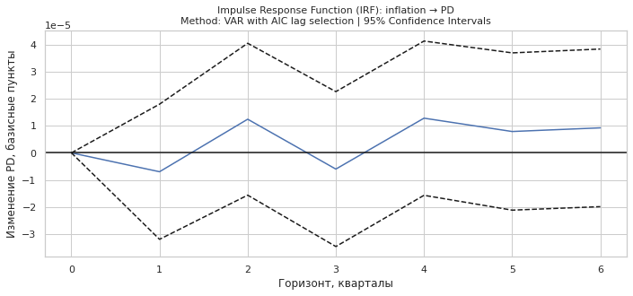

# Моделирование управления кредитным портфелем с учетом макроэкономических условий  

**Курсовая работа**  

Факультет вычислительной математики и кибернетики МГУ им. М.В. Ломоносова.  
**Автор:** Кирякин Максим Валерьевич  
**Научный руководитель:** к.ф.м.н. Куренной Дмитрий Святославович  

---

## Актуальность

<div style="text-align: justify;">
Современная мировая экономика сталкивается с беспрецедентными вызовами: пандемия COVID-19, геополитические конфликты, рекордная инфляция в развитых странах и энергетический кризис в Европе. Эти факторы формируют среду повышенной неопределенности, где традиционные методы управления кредитным портфелем становятся неэффективными. Резкие колебания ключевых макроэкономических показателей — ВВП, безработицы, ставок ЦБ и др. напрямую влияют на платежеспособность заемщиков, увеличивая риски дефолтов. В таких условиях разработка моделей, учитывающих не только микроэкономические, но и макроэкономические параметры, становится критически важной для прогнозирования устойчивости кредитного портфеля и минимизации убытков.
</div>

---

## О проекте
Исследование направлено на разработку модели управления кредитным портфелем российских банков с учетом макроэкономических факторов. В работе:
- Проведен анализ современных методов оценки кредитного риска (Moody’s KMV, Credit Portfolio View).
- Реализована адаптация модели Мертона для расчета вероятности дефолта (PD) с учетом макроэкономических индикаторов (инфляция, ключевая ставка ЦБ РФ, курс рубля).
- Разработан программный комплекс на Python для анализа портфеля, включая методы Ridge-регрессии, VAR-анализа и визуализации данных.
- Выявлены ключевые закономерности влияния макрошоков на устойчивость заёмщиков.

---

## Установка и требования
Для запуска кода необходимы:
- Python 3.10+
- Библиотеки: `numpy`, `pandas`, `scipy`, `matplotlib`, `statsmodels`, `scikit-learn`

Репозиторий включает:
- Класс `Portfolio` для управления данными и расчетов.
- Примеры использования (см. раздел [Пример запуска](#пример-запуска)).

---

## Ключевые результаты
### 1. Влияние макроэкономических факторов на PD
- Рост инфляции на 1% увеличивает PD на 1.2 б.п. для Газпрома.
- Ослабление рубля (USD/RUB) положительно влияет на капитализацию сырьевых компаний (коэф. 0.073 для GMKN), но повышает долговую нагрузку экспортно-ориентированных предприятий (коэф. -0.094 для Роснефти).

  

*Рис. 1: Вероятность дефолта (PD) для Газпрома.*

### 2. Анализ импульсных откликов (IRF)
- Шок инфляции вызывает немедленный рост PD (1.5–2 б.п.).
- Шок ключевой ставки достигает пика через 3–4 квартала.

 
 

*Рис. 2: Реакция PD на макроэкономические шоки.*

### 3. Корреляционный анализ
- Низкая внутрисекторная корреляция (напр., 0.29 между Газпромом и Лукойлом) указывает на необходимость индивидуального подхода к рискам.

  

*Рис. 3: Корреляция цен акций компаний портфеля.*

---

## Пример запуска
```python
from utils.portfolio import Portfolio

# Создание экземпляра класса
calc = Portfolio(
    dt_calc='30.10.2024',
    dt_start='03.11.2019',
    tickers_list=['GAZP', 'SBER', 'GMKN', 'ROSN', ...]
)

# Загрузка данных и запуск расчетов
calc.load_stock_data()
    .add_macro_data()
    .add_merton_pd()
    .plot_pd_by_tickers()
    .calc_irf()
    .plot_correlation_matrix()
